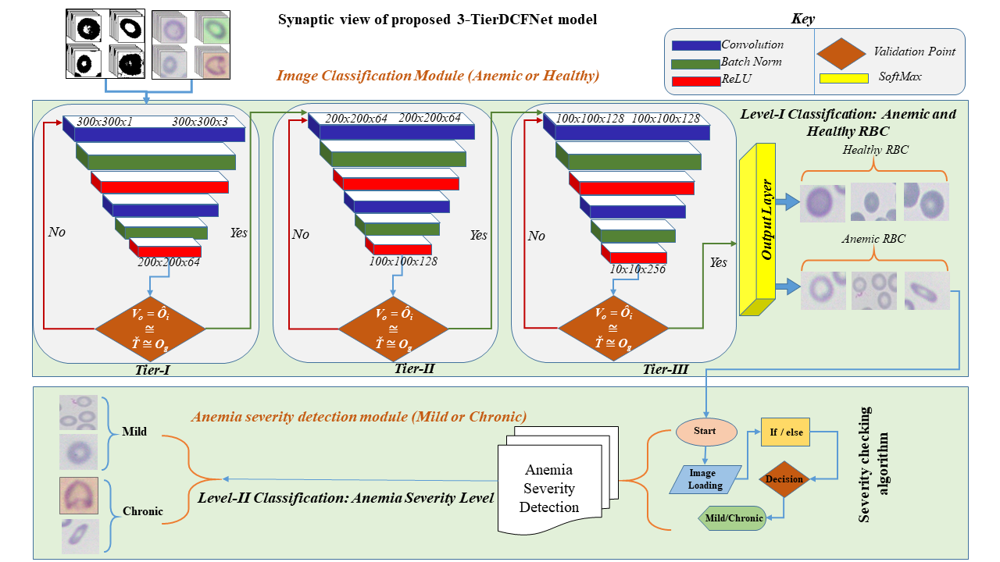
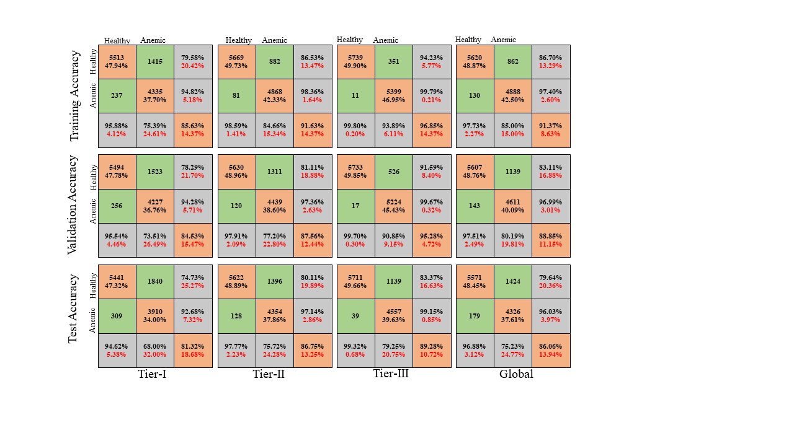

# [Identification of Anemia and its severity level in a peripheral blood smear using 3-Tier Deep Neural Network]

------

# Introduction
This research aims to develop a CNN-based model for automatically identifying Anemic and healthy RBC elements in the microscopic image. This model will also find the severity level of Anemic RBC elements by targeting changes in shape and size of infected RBC.  We have developed a state-of-the-art anemic RBCs dataset named Anemic-RBC dataset. The proposed dataset comprises a total of 11,500 images with approximately 750,000 RBCs elements. Out of 11,500 images, 5,750 are normal, 5,750 anemic images with manually generated ground truth (binary and pixel-wise). The key contribution of the proposed research work are:-
•	A CNN-based 3-Tier deep convolutional fused neural network (3-TierDCFNet) architecture that performs two-stage classification of RBC images. 
•	Module-I classifies the input image into two classes, i.e., Healthy and Anemic image. Module-II detects anemic image severity levels and classifies them into mild or chronic.
•	 Module-II of 3-TierDCFNet also provides accurate detection of overlapped structures of Anemic RBCs.
•	We have developed a standalone RBC microscopic image dataset along with manually segmented ground truth images of both healthy and Anemic-RBCs under the supervision of a hematologist/pathologist for cross-match analysis.

      
    <em> 
    Figure 2: Synaptic view of proposed 3-Tier CNN model. The 300x300x1 represents binary input while 300x300x3 represents RGB original image. Lable "Yes" means the training accuracy of the nth Tier is equal to the predefined threshold value. Then the output is given to the next Tier for further processing. The label "No" means the training accuracy of the nth Tier is not equal to the predefined threshold value. Then the output is given to the same Tier for more optimal feature selection. Tier-I includes the DenseNet model that receives input images of 300x300x3 and produces output 200x200x64. Tier-II is equipped with EfficeintNet to preserve semantic information and extract the features upto 100x100x128; Tier-III comprises ShuffleNet, which ensures high accuracy with less computational cost. 
    </em>

# Results

      
    <em> 
    Figure 2: Confusion matrix of training, validation, and testing accuracies of Module-I classification.
    </em>

# Training

Please refer to [3TDCFNet_train.py](??????3TDCFNet_train.py).

------

# Contact

Please feel free to drop an e-mail to mscs1122@gmail.com for any questions. 

------

    }

